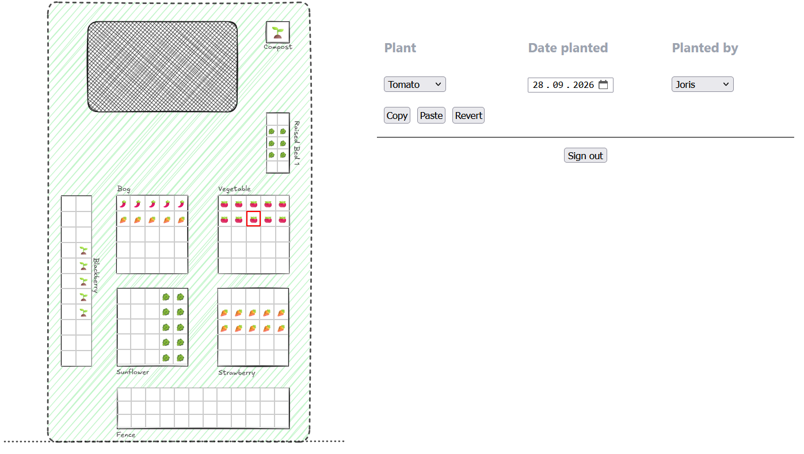

# Garden 405

**JavaScript/React practice project**

JavaScript/React practice project

Every year, our little garden with the plot number 405 flourishes with plants of all kinds, but when harvest season comes around, we often forget which crops we planted where.

Garden 405 is a small web application for organizing our garden plots and keeping track of the plants growing in them.

You can explore the current once we go online. Since this application contains data from our real garden, visitor accounts and write access are disabled. You are nevertheless welcome to explore the application or deploy your own instance and adapt it to your needs.



## Getting Started

### Prerequisites

Make sure you have [Node.js](https://nodejs.org/) installed.

### Installation

Clone the repository and install the dependencies:

```bash
git clone https://github.com/JorisKaestner/garden-405.git
cd garden-405
npm install
```

### Setup Supabase
This application uses Supabase for persistent storage. Create a project at https://supabase.com/ and run the database table creation script which can be found at [src/supabase/demo_data/create_tables.sql](src/supabase/demo_data/create_tables.sql) in the SQL editor. Demo data can then be inserted with [insert_demo_data.sql](src/supabase/demo_data/insert_demo_data.sql).

Setup your site URL (http://localhost:5173/) at `Project > Authentication > URL Configuration`.

#### (Optional) Setup SMTP
The free plan of Supabase allows a very limited number of emails to be sent. To use magic links for logging into the application, you can upgrade your plan or set up your own SMTP provider at `Project > Authentication > Emails > SMTP Settings`. I use [Resend](https://resend.com/), as it comes with a generous free plan. You may need a valid domain to get a sender email address.

You can use the default sender email address `onboarding@resend.dev` for testing. This address can only send to the email, you used to create your Resend account.

#### (Optional) Add Users
Authentication is handled through Supabase Auth using passwordless magic links.
Users must be added manually through the Supabase dashboard:
`Project > Authentication > Users`
There is currently no public registration form because this application is intended for private use.

### Environment Variables

Create a `.env.local` file in the project root and add the required Supabase configuration:

```env
VITE_SUPABASE_URL=https://your-supabase-id.supabase.co
VITE_SUPABASE_ANON_KEY=your-supabase-anon-key
```

You can find your API key at `Project > Settings > API Keys` and your project id in the taskbar or at `Project > Settings > General`.

Do not commit your `.env` file to the repository.

### Development

Start the Vite development server:

```bash
npm run dev
```

You can usually access the application locally at:

```text
http://localhost:5173
```

## Production Build

Create a production build with:

```bash
npm run build
```

The resulting files are generated in the `dist/` directory.


## Project Structure

```text
garden-405/
├── public/          # Vite Static assets
├── src/             # Application source code
├── .env.local       # Local environment variables
├── index.html       # HTML entry point
├── package.json     # Dependencies and scripts
├── tsconfig.json    # TypeScript configuration
└── vite.config.ts   # Vite configuration
```

```text
src/
├── assets                      # static assets like the backdrop for the layout
└── components                  
    ├── Garden.tsx              # main component of Garden application. Holds all states
    ├── GardenCell.tsx          # single garden cell component
    ├── GardenGrid.tsx          # arranges multiple GardenCells as grid
    ├── LoginForm.tsx           # send login events to Supabase Auth
    └── SelectionInfoPanel.tsx  # display and edit information about plots
└── supabase  
    ├── demo_data               # database creation scripts and demo data
    ├── AuthContext.tsx         # Supabase authentication provider           
    └── supabaseClient.ts       # creates Supabase client
├── App.css                     # styling
├── App.tsx                     # App main entrypoint
├── index.css                   # styling
├── main.tsx                    # React main entrypoint
└── types.ts                    # TypeScript types
```

## Personalize your garden
Once you have deployed this project, you can customize the garden layout to your needs with a bit of effort. 
1. Insert your own background image by replacing [src/assets/gardenLayout.svg](src/assets/gardenLayout.svg) with your own image. This could be a satellite image or a quick sketch. I recommend [Excalidraw](https://excalidraw.com/) to create a simple layout within a few minutes.

2. Insert your beds into the 'beds' table in Supabase. See [src/supabase/demo_data/insert_demo_data.sql](src/supabase/demo_data/insert_demo_data.sql) for reference. Adjust the position, height and width to your needs. Excalidraw provides reference points about the objects.

3. Once you have created the beds (they don't need to fit perfectly yet) generate the plots with the following SQL command:

```SQL
insert into plots (id, "gardenId", row, col)
select b.id || '-' || r.n || '-' || c.n, b.id, r.n, c.n
from beds b
cross join generate_series(0, b.rows - 1) as r(n)
cross join generate_series(0, b.cols - 1) as c(n)
on conflict (id) do nothing;
``` 

Reload the site and you should see your beds by now. Fine tune from here.

## License
MIT — see [LICENSE](LICENSE) for details.
